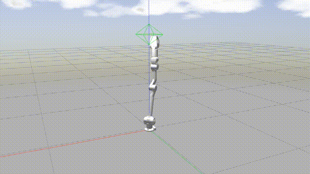
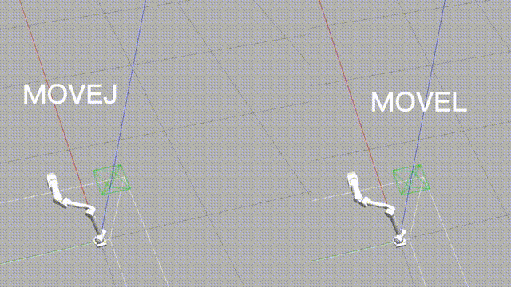

# 控制模式

z1机械臂提供了多种上层控制模式，如关节空间控制、笛卡尔空间控制、MOVEJ、MOVEL、MOVEC等，
理解这些控制模式使得用户在使用时能更好地知道如何发送命令从而控制机械臂运动。

## 关节空间控制

 

关节空间控制演示

 

关节空间控制：针对机器人各关节的变量进行的控制。
用户直接地给定关节的角度命令，从而控制机械臂的运动。

如上图例所示，该示例是机械臂依次转动J2、J3、夹爪的结果。

## 笛卡尔空间控制

 

笛卡尔空间控制演示

 

笛卡尔空间控制：针对机器人末端的位姿变量进行控制。
用户直接地给将期望的机械臂的末端姿态发给机械臂控制器`z1_ctrl`，`z1_ctrl`经过运动学、动力学解算后得到机械臂各关节应该到达的角度、角速度，然后将这些命令发送至机械臂，从而控制机械臂的运动。

 

笛卡尔空间控制

 

默认将gripper坐标系作为机械臂末端控制参考系。

但在`z1_ctrl`中，功能严格意义上应该称为笛卡尔空间速度控制，即用户每次只给定机械臂末端位姿的增量。

## MOVEJ

 

MOVEJ演示

 

在**笛卡尔空间控制**模式中，用户给定的是机械臂末端位姿的增量，而在**MOVEJ**中用户可以直接给定一个或多个期望的末端位姿，从而控制机械臂的运动。
在该模式中，机械臂将以最快捷的方式运动到目标点，其运动状态不完全可控，但运动路径保持唯一。

## MOVEL

 

MOVEL演示

 

在**MOVEL**模式中，机械臂将以直线运动轨迹从一个末端位姿运动到下一个末端位姿。

## MOVEC

在**MOVEC**模式中，机械臂将根据给定的初始点，以圆弧运动方式通过中间点到达目标点。
