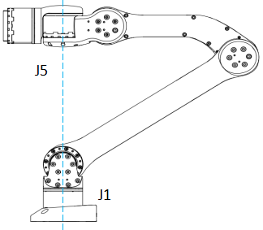

# 奇异点

## 概念

机械臂处于奇异位置，自由度将发生退化，会造成某些关节的角速度无限大，机械臂有失控风险。

## 奇异位置

肩关节奇异：第五个关节轴线与第一个关节轴线同轴区域为本机械臂的奇异位置，如下图。

在笛卡尔空间下，应尽量避开此区域。针对奇异位置的问题，本机械臂采取的处理方式为QP求逆运动学解

建议机械臂上电后运行至forward点位，避开该区域。

 

机械臂奇异位置

 
