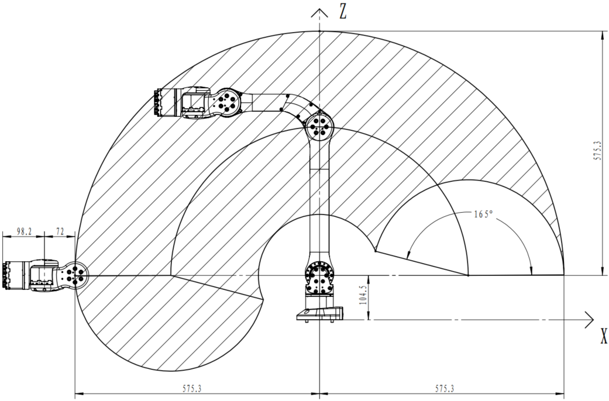

# 机械臂安装

## 机械臂运动范围

在安装机械臂时，要考虑机械臂的运动范围一面造成不必要的损失。
机械臂的运动范围如下图所示

 

 

各个关节的运动范围如下表所示

<!-- <table>

|关节|最小角度|最大角度|
|:-:|:-:|:-:|
|J1|-150°|150°|
|J2|0|180°|
|J3|-165°|0|
|J4|-100°|100°|
|J5|-89°|89°|
|J6|-160°|160°| -->

<table border="1">
    <tr><td>关节</td><td>最小角度</td><td>最大角度</td></tr>
    <tr><td>J1</td><td>-150°</td><td>150°</td></tr>
    <tr><td>J2</td><td>0°</td><td>180°</td></tr>
    <tr><td>J3</td><td>-165°</td><td>0°</td></tr>
    <tr><td>J4</td><td>-100°</td><td>100°</td></tr>
    <tr><td>J5</td><td>-89°</td><td>89°</td></tr>
    <tr><td>J6</td><td>-160°</td><td>160°</td></tr>
</table>

实际计算采用弧度制，还有其他如坐标轴、惯性矩阵等信息都在~/z1_ws/src/z1_ros/z1_description/xacro的文件里有描述。

## 安装机械臂

用户在固定机械臂时可根据机械臂底座孔位尺寸及真实环境自行设计安装台架，机械臂的固定台架不仅需要承受机械臂自身的重量，还要承受最大加速度运动时的瞬时动态作用力。
机械臂使用4颗M6螺栓，用内六角扳手安装机械臂。底座安装图如下

 

机械臂底座螺丝安装图

 

当然，我们提供了固定板及G夹，方便直接固定到桌面上。

 

机械臂安装图

 

## 线缆连接

机械臂线缆主要有两种：供电线和通信线。机械臂供电线的接头具备防呆功能，供电线插入下图所示的机械臂供电接口即可。同时将通信线(即网线)的一端插入下图所示的机械臂网口并锁紧即可，通信线的另一端连接电脑。

 

机械臂线缆连接图

 

## 上电

机械臂重新上电前一定要**确保运动程序关闭**，否则会有危险发生的可能。并让机械臂处于零位，
机械臂零位姿态如下图，J1、J6关节缝隙两侧的线完全对应，其他关节摆放到位即可。

 

机械臂上电零位连接图

 

成功上电时，自检通过机械臂绿灯会常亮，蓝灯闪烁。

需注意，每次使用前将机械臂各关节转到零位，这是为了让控制算法中的理论零位与实际机械零位重合。另外，机械臂末端电机的黑白电源线是有DC24V电的，如果不需要，请务必把黑白电源线用绝缘胶带缠绕固定，防止短路等发生危险。

## 关节说明

 

z1机械臂关节序号及关节转动正方向定义

 

在开始控制前，我们有必要了解下机械臂关节的定义及转动的正方向定义。宇树Z1机械臂是六自由度机械臂，其各关节序号从J1开始，逐个递增至J6。在上图中`+`键表示关节转动的正方向，`-`键表示关节转动的负方向。了解转动的正方向对之后的关节空间控制的使用很有帮助。

基于指数积进行机械臂各种运算所需的参数如下：

|关节|ω|υ|
|:-:|:-:|:-:|
|J1|[0, 0, 1]|[0, 0, 0.065]|
|J2|[0, 1, 0]|[0, 0, 0.1115]|
|J3|[0, 1, 0]|[-0.35, 0. 0.1115]|
|J4|[0, 1, 0]|[-0.132, 0, 0.1685]|
|J5|[0, 0, 1]|[-0.06, 0, 0.1685]|
|J6|[1, 0, 0]|[-0.0128, 0, 0.1685]|

其中手爪装载平面（即J6末端平面）的绝对初始位置为[0,049, 0, 0.1605]
Unitree_gripper中心相对于装载平面的位置为[0.0382, 0, 0]，即config.xml里的endPosLocal参数
