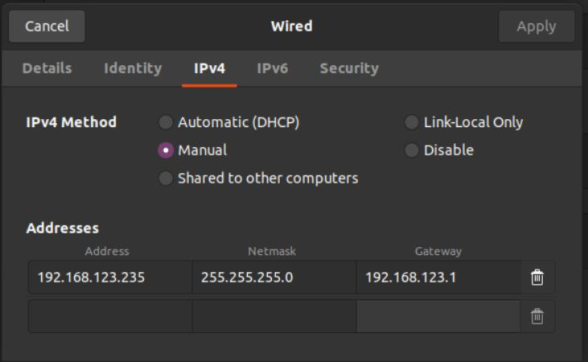

# 环境搭建

## 概要

机械臂SDK与机械臂控制器均基于Ubuntu18.04构建，同时在仿真控制中依赖的ROS系统为Melodic版本。故为了能更好地使用，请用户尽量之保持一致。如果仅使用实机操控，也无需安装ROS

除此之外，机械臂SDK与机械臂控制器还依赖了一些第三方工具，用户在使用前需要将这些第三方工具安装好。

为了方便用户使用，我们也在z1_sdk/thirdparty/目录下提供了Eigen包，解压后可以直接根据以下步骤进行安装。

## 依赖库安装

+ build-essential

```shell
sudo apt install build-essential
```

+ Boost (1.5.4版本 或 更高)

```shell
dpkg -S /usr/include/boost/version.hpp      # check boost version
sudo apt install libboost-dev               # install boost
```

+ CMake (2.8.3版本 或 更高)
  
```shell
cmake --version             # check cmake version
sudo apt install cmake      # install cmake
```

+ Eigen (3.3.9版本)

如果已安装旧版本Eigen，可以先卸载，如果没有可以直接进行下一步安装。

卸载旧版本

```shell
cd /usr/include
sudo rm -rf ./eigen3
```

编译安装

```shell
cd eigen-3.3.9
mkdir build
cd build
cmake ..
sudo make install

sudo ln -s /usr/local/include/eigen3  /usr/include/eigen3
sudo ln -s /usr/local/include/eigen3/Eigen  /usr/local/include/Eigen
```

## ROS(melodic)安装

参考ROS官方[melodic安装教程](http://wiki.ros.org/melodic/Installation/Ubuntu)

其中中国用户在使用在使用rosdep时可能会因为无法连接外网而发生错误，可以尝试通过国内小鱼ROS开发的rosdepc命令执行。

添加ROS源

```shell
sudo sh -c '. /etc/lsb-release && echo "deb http://mirrors.tuna.tsinghua.edu.cn/ros/ubuntu/ `lsb_release -cs` main" > /etc/apt/sources.list.d/ros-latest.list'
sudo apt-key adv --keyserver 'hkp://keyserver.ubuntu.com:80' --recv-key C1CF6E31E6BADE8868B172B4F42ED6FBAB17C654
```

安装melodic桌面版ros-melodic-desktop-full

```shell
sudo apt update
sudo apt install ros-melodic-desktop-full
```

安装ros依赖

```shell
sudo apt-get install python3-pip 
sudo pip3 install rosdepc
sudo rosdepc init
rosdepc update
```

添加ros环境变量

```shell
echo "source /opt/ros/melodic/setup.bash" >> ~/.bashrc
source ~/.bashrc
```

安装结束

## 网络配置

### PC防冲突IP更改

机械臂的默认IP为192.168.123.110，用户需要在使用SDK之前更改PC的IP，使用192.168.123网段。

以更改为192.168.123.162示例，在终端中运行ifconfig，您将找到您的端口名称（可通过插拔网线，查看增加/减少的端口，来查找对应的端口名称）。例如，enpxxx.

```shell
sudo ifconfig enpxxx down        # enpxxx is your PC port 
sudo ifconfig enpxxx 192.168.123.162/24 
sudo ifconfig enpxxx up 
```

以上方式为临时更改IP使用，您也可以将永久更改PC的IP，操作如下

```shell
sudo vim /etc/network/interfaces
```

添加一下文本至上述打开的interfaces文件中

```shell
auto enpxxx
iface enpxxx inet static
address 192.168.123.162
netmask 255.255.255.0
```

此时可以通过ping 192.168.123.110指令检测与机械臂连接是否正常。

也可直接在系统网络设置的如下界面更改：

<center>

<br>
<div style="color:orange; border-bottom: 0.1px solid #d9d9d9;
display: inline-block;
color: #999;
padding: 1px;">固定本机IP地址</div>
</center>
<br>
