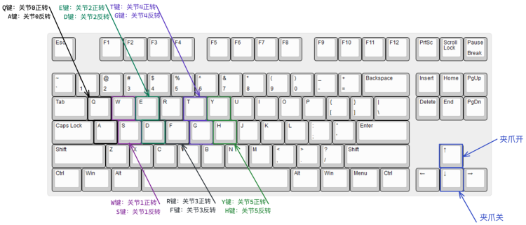

# SDK运行

## ROS仿真

**①** 打开仿真

如果用户对ros文件不太熟悉，请在home下创建`unitree_ws/src`文件并将`unitree_ros`文件移动到`/home/username/unitree_ws/src/unitree_ros`
同时下载[unitree_legged_msgs](https://github.com/unitreerobotics/unitree_ros_to_real)放入`unitree_ws/src/`目录下

```shell
cd ~/unitree_ws                                             #打开该文件夹
catkin_make                                                 #初始化ROS工作空间
echo “source ~/unitree_ws/devel/setup.bash”>>~/.bashrc     #将ros路径添加到环境变量，可由pwd命令获取当前路径替换该路径
source ~/.bashrc                                            #更新环境变量
```

在终端执行`roslaunch unitree_gazebo z1.launch`，如果成功配置此时可以显示出gazebo的仿真界面。

```text
Tips：可以在输入 roslaunch z后按tap查看是否终端会自动补全，如果成功出现roslaunch z1_说明路径设置成功
```

**②** 打开z1_controller文件夹下的CMakeLists文件，更改编译条件如下

```cmake
# set(COMMUNICATION UDP)             #UDP
set(COMMUNICATION ROS)               #ROS
```

**③** 编译z1_controller，在该文件夹下创建build文件夹（打开第2个终端）

```shell
mkdir build
cd build
cmake ..
make
```

输入`./z1_Ctrl`执行build文件夹内的可执行文件（默认通过sdk进行控制，如需直接使用键盘控制，可以执行`./z1_ctrl k`）

当执行该条命令后，终端会不断地打印`[WARNING] UDPPort::recv, unblock version, connect wit z1_sdk wait time out`语句，这是正常的，因为我们还没有启动机械臂SDK与机械臂控制器通信。

**各种信息都会在这个窗口打印，用户使用使请多观察此窗口内容。**

**④** 打开z1_sdk文件夹，在该文件夹下创建build文件夹（打开第3个终端）

```shell
mkdir build
cd build
cmake ..
make
```

执行build文件夹内的可执行文件

本次我们执行./highcmd_basic, 会执行一个示例动作

```shell
./highcmd_basic
```

+ 键盘操作 *具体的键位在状态机小节会有介绍*

在键盘上先按2进入关节空间，再按0键，此时机械臂会进入标签运行状态机，终端输入forward后enter，机械臂会向前运行，再按 ~ 键会回到原点。回到原点后会自动进入关节控制模式，此时可根据以下键位**长按**控制机械臂转动。

<center>

<br>
<div style="color:orange; border-bottom: 0.1px solid #d9d9d9;
display: inline-block;
color: #999;
padding: 1px;">关节空间速度控制按键图示</div>
</center>
<br>

此时我们已经完成仿真操作，整个流程为&emsp;**运行ROS-->运行z1_ctrl-->运行SDK实例**

## 实机控制

**①** 首先对机械臂进行通电，并通过ping 192.168.123.110指令查看是否通信正常

**②** 打开z1_controller文件夹下的CMakeLists文件，更改编译条件如下

```cmake
set(COMMUNICATION UDP)               #UDP
# set(COMMUNICATION ROS)             #ROS
```

**③** 执行`./z1_ctrl`

**④** 执行`./highcmd_basic`

此处和仿真的操作一致，此时已经了解如何控制机械臂，更多操作方法将在[基础概念](../2-basic/sdk.md)小节介绍
