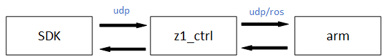

# Z1

欢迎您使用Unitree机械臂，并感谢您的购买。

本文档记载了有关Z1机械臂的安装、调试、以及如何基于API进行二次开发的相关信息。

机械臂使用人员应充分了解风险，使用前必须认真阅读本手册，严格遵守手册中的规范和要求。

<!--PS：如果您第一次使用本产品，可以先阅读第三小节[SDK使用](3-sdk/)-->
<!-- **SDK下载链接**:

含Unitree手爪：<a href="downloads/z1_sdk.2022.8.11.zip" download>z1_sdk.2022.8.11</a>

无Unitree手爪：<a href="downloads/z1_sdk.2022.8.12.zip" download>z1_sdk.2022.8.12</a>

PS：用户需根据自身使用情况下载相应的SDK。 

## 安全说明

### 注意事项

1.请务必按照本手册中的要求安装机械臂、连接线缆

2.确保机械臂的活动范围内不会碰撞到人或其他物品，以免发生意外

3.在使用前，需要专业的人员进行调试

4.在使用SDK时，必须确保输入的参数和操作流程是正确的

5.机械臂在运行过程中会产生热量，在运行或刚停止时，请不要触摸机械臂

6.请注意机械臂运行速度，过快时务必小心

7.机械臂使用结束后，请务必断电

8.避免在潮湿或粉尘的环境下使用机械臂

9.请务必将机械臂存放、安装到儿童碰不到的地方，以免发生危险
-->

## 概要

宇树机械臂可以实现关节空间控制、笛卡尔空间控制等多种上层控制模式，还可以实现对底层关节电机的底层控制，用户可以基于此开发自己的控制算法。要实现上述控制则依赖于机械臂SDK的使用。目前通过机械臂SDK对机械臂的控制方式有两种：
+ **程序代码控制** \
可以通过编写C++程序来调用机械臂开发接口来控制机械臂。
+ **键盘控制** \
可以通过键盘直接地控制机械臂。

机械臂SDK还支持对机械臂的实物控制和仿真控制，其中仿真控制使用的仿真器是Gazebo。

## 文件结构

关于机械臂SDK的文件存储在z1_sdk.20xx.x.x.zip文件夹中，其中20xx.x.x为该SDK发布日期。

该压缩包中包含三个子文件：z1_controller、z1_sdk及z1_ws。

+ z1_controller

该文件夹包含了机械臂的控制实现部分。

+ z1_sdk

该文件夹包含控制程序的接口。

+ z1_ws

该文件夹属于ROS的一个工作空间，其中z1_ws/src/z1_ros文件夹下包含了ROS仿真模型的相关文件。

 

关系图

 

如图所示，在仿真控制时机械臂的控制器`z1_ctrl`通过ros系统对gazebo中的机械臂发布命令进行控制，在实物控制中则通过udp对实物机械臂发布命令进行控制，而机械臂相关的状态(如：关节信息、末端位姿等)则通过同样的方式返回至`z1_ctrl`。机械臂sdk`unitree_arm_sdk`通过udp将用户的控制命令(不管是上层控制命令还是底层控制命令)发送至`z1_ctrl`，同时`z1_ctrl`将机械臂返回的状态信息通过udp反馈至`unitree_arm_sdk`，用户通过读取相关结构体获取相关信息。\
&emsp;&emsp;故因为这三者存在上述所述关系，用户在实际使用时的启动流程应是：

1. 启动`机械臂`：如是实物控制，则检查机械部是否上电成功和设备灯是否闪烁。若是仿真控制，则检查是否启动`roslaunch z1_gazebo z1.launch`命令(下文介绍)。

2. 启动`z1_ctrl`

3. 启动`unitree_arm_sdk`
