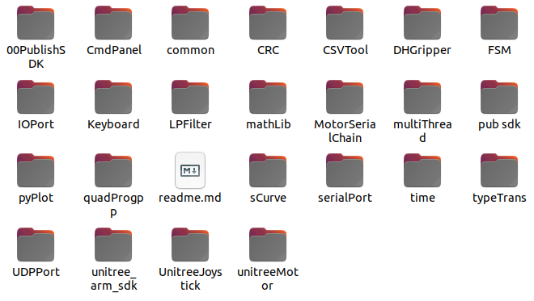

# 机械臂SDK介绍

## 文件结构
&emsp;&emsp;所有关于机械臂SDK的文件会放在一个名叫z1_sdk_20xx.x.x.zip的压缩包,**Z1_sdk**是SDK的名字，**20xx.x.x**是该SDK的发布日期。该压缩包中有两个子文件夹：z1_sdk与z1_ws，其中z1_ws里存放着z1机械臂的控制器`z1_ctrl`，其属于ROS系统的一个工作空间。z1_sdk则是关于机械臂sdk `unitree_arm_sdk`的文件夹。打开z1_sdk文件夹可以发现里面有很多子文件夹:
<!--  -->

 

z1_sdk文件夹内容

 

&emsp;&emsp;其中**unitree_arm_sdk**子文件夹里便存放着机械臂sdk `unitree_arm_sdk`，其余子文件夹则为`unitree_arm_sdk`的依赖。打开**unitree_arm_sdk**文件夹发现其内也有许多子文件\子文件夹:
<!-- \ -->

 

unitree_arm_sdk文件夹内容

  

其作用分别为：
+ build:&emsp;为`unitree_arm_sdk`编译时储存可执行文件和中间文件的文件夹。
+ CMakeLists.txt:&emsp;为指导`unitree_arm_sdk`编译的文件，通过修改其中的内容可以修改对机械臂的仿真控制或实物控制。
+ demo: &emsp;存放着用程序代码控制方式控制机械臂的例子的源码文件。
+ examples:&emsp;存放着用键盘控制方式控制机械臂的例子的源码文件。
+ include:&emsp;存放着`unitree_arm_sdk`源码对应的头文件。
+ src:&emsp;存放着`unitree_arm_sdk`底层运行逻辑的源码。
+ unitreeArm:&emsp;存放着unitreeArm类的源码文件，该类中有工程师为了使用者能方便地调用机械臂API而封装的方法。该类与demo文件夹下的例子息息相关。
