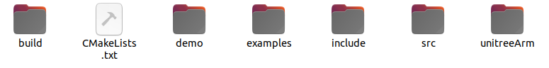
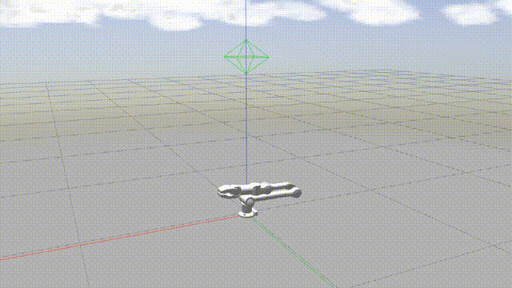
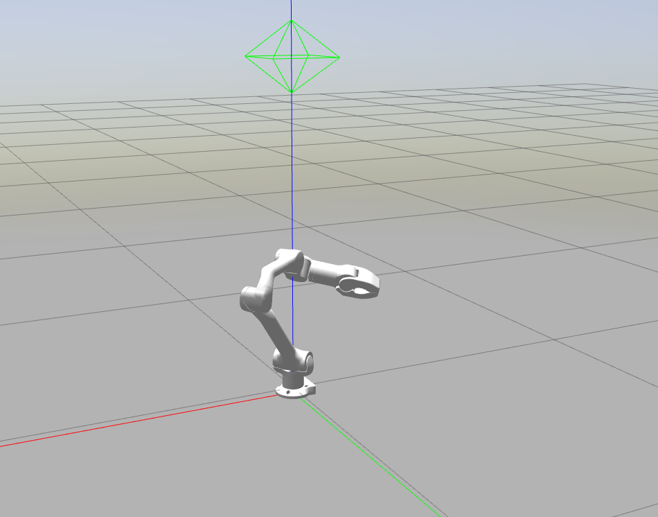
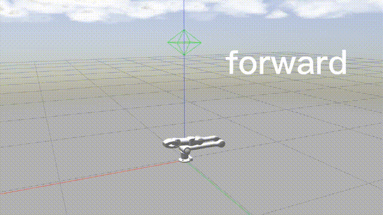

## 机械臂SDK介绍
### 概要
&emsp;&emsp;宇树机械臂可以实现关节空间控制、笛卡尔空间控制等多种上层控制模式，还可以实现对底层关节电机的底层控制，用户可以基于此开发自己的控制算法。要实现上述控制则依赖于机械臂SDK的使用。目前通过机械臂SDK对机械臂的控制方式有两种：
+ **程序代码控制** \
程序代码控制方式即我们可以通过编写C++程序来调用机械臂开发接口来控制机械臂。
+ **键盘控制** \
键盘控制方式即我们可以通过键盘直接地控制机械臂。

机械臂SDK还支持对机械臂的实物控制和仿真控制，其中仿真控制使用的仿真器是Gazebo。

### 文件结构
&emsp;&emsp;所有关于机械臂SDK的文件会放在一个名叫z1_sdk_20xx.x.x.zip的压缩包,**Z1_sdk**是SDK的名字，**20xx.x.x**是该SDK的发布日期。该压缩包中有两个子文件夹：z1_sdk与z1_ws，其中z1_ws里存放着z1机械臂的控制器`z1_ctrl`，其属于ROS系统的一个工作空间。z1_sdk则是关于机械臂sdk `unitree_arm_sdk`的文件夹。打开z1_sdk文件夹可以发现里面有很多子文件夹:
<!--  -->

 

z1_sdk文件夹内容

 

&emsp;&emsp;其中**unitree_arm_sdk**子文件夹里便存放着机械臂sdk `unitree_arm_sdk`，其余子文件夹则为`unitree_arm_sdk`的依赖。打开**unitree_arm_sdk**文件夹发现其内也有许多子文件\子文件夹:
<!-- \ -->

 

unitree_arm_sdk文件夹内容

  

其作用分别为：
+ build:&emsp;为`unitree_arm_sdk`编译时储存可执行文件和中间文件的文件夹。
+ CMakeLists.txt:&emsp;为指导`unitree_arm_sdk`编译的文件，通过修改其中的内容可以修改对机械臂的仿真控制或实物控制。
+ demo: &emsp;存放着用程序代码控制方式控制机械臂的例子的源码文件。
+ examples:&emsp;存放着用键盘控制方式控制机械臂的例子的源码文件。
+ include:&emsp;存放着`unitree_arm_sdk`源码对应的头文件。
+ src:&emsp;存放着`unitree_arm_sdk`底层运行逻辑的源码。
+ unitreeArm:&emsp;存放着unitreeArm类的源码文件，该类中有工程师为了使用者能方便地调用机械臂API而封装的方法。该类与demo文件夹下的例子息息相关。

### 关系
&emsp;&emsp;下面介绍一下`unitree_arm_sdk`与`z1_ctrl`与`机械臂`间的关系,这里`机械臂`指的是仿真中的机械臂或真实世界中的机械臂。这将有助于我们理解下文中介绍的启动对机械臂控制时输入的命令。
<!--  -->

 

关系图

 

如上图所示，在仿真控制时机械臂的控制器`z1_ctrl`通过ros系统对gazebo中的机械臂发布命令进行控制，在实物控制中则通过udp对实物机械臂发布命令进行控制，而机械臂相关的状态(如：关节信息、末端位姿等)则通过同样的方式返回至`z1_ctrl`。机械臂sdk`unitree_arm_sdk`通过udp将用户的控制命令(不管是上层控制命令还是底层控制命令)发送至`z1_ctrl`，同时`z1_ctrl`将机械臂返回的状态信息通过udp反馈至`unitree_arm_sdk`，用户通过读取相关结构体获取相关信息。\
&emsp;&emsp;故因为这三者存在上述所述关系，用户在实际使用时的启动流程应是：
1. 启动`机械臂`：如是实物控制，则检查机械部是否上电成功和设备灯是否闪烁。若是仿真控制，则检查是否启动`roslaunch z1_gazebo z1.launch`命令(下文介绍)。
2. 启动`z1_ctrl`:检查是否启动`z1_ctrl`。
3. 启动`unitree_arm_sdk`: 检查是否启动`unitree_arm_sdk`。                    

## 关节及坐标系定义

 

z1机械臂关节序号及关节转动正方向定义

 

&emsp;&emsp;在开始控制前，我们有必要了解下机械臂关节的定义及转动的正方向定义。宇树Z1机械臂是六自由度机械臂，其各关节序号从J1开始，逐个递增至J6。在上图中`+`键表示关节转动的正方向，`-`键表示关节转动的负方向。了解转动的正方向对下文中的关节空间控制的使用很有帮助。

## 控制模式
&emsp;&emsp;z1机械臂提供了多种上层控制模式，如关节空间控制、笛卡尔空间控制、MOVEJ、MOVEL等，理解这些控制模式使得用户在使用时能更好地知道如何给`z1_ws`发命令从而控制机械臂运动。
+ **关节空间控制**

 

关节空间控制演示

 

&emsp;&emsp;关节空间控制，故名思义，即用户直接地给定关节的角度命令，从而控制机械臂的运动，如上图所示例，该示例是机械臂依次转动J2、J3、夹爪的结果。但在实际场景中，我们可能更希望直接地给定机械臂的末端位姿，来控制机械臂的运动，这就是下文介绍的笛卡尔空间控制。

+ **笛卡尔空间控制**

 

笛卡尔空间控制演示

 

 

笛卡尔空间控制

 

&emsp;&emsp;笛卡尔空间控制，即用户直接地给将期望的机械臂的末端姿态发给机械臂控制器`z1_ctrl`，`z1_ctrl`经过运动学、动力学解算后得到机械臂各关节应该到达的角度、角速度，然后将这些命令发送至机械臂，从而控制机械臂的运动。但在`z1_ctrl`中，功能严格意义上应该称为笛卡尔空间控制速度控制，即用户每次只给定机械臂末端位姿的增量。

+ **标签记录**

 

标签记录演示

 

&emsp;&emsp;`z1_ctrl`允许将机械臂某一时刻的各关节角度记录为一个标签，我们称此功能为 **标签记录**。如上图中，我们将该位置记录为标签"test"。记录的标签保存于savedArmStates.csv文件中。

+ **标签运行**

 

标签运行演示

 

&emsp;&emsp;`z1_ctrl`也允许用户给定一个标签来控制机械臂的运动，我们称此功能为 **标签运行**。`z1_ctrl`中也有许多有用的内置标签，如:`startFlat`、`forward`。上图为控制机械臂按`forward`、"test"标签依次运动的效果。

+ **MOVEJ**

 

MOVEJ演示

 

&emsp;&emsp;在**笛卡尔空间控制**模式中，用户给定的是机械臂末端位姿的增量，而在**MOVEJ**中用户可以直接给定一个或多个期望的末端位姿，从而控制机械臂的运动。在该模式，虽然机械臂末端最终会到达给定的末端位姿，但其在一个末端位姿运动到下一个末端位姿的过程中，机械臂末端的运动轨迹未必是直线的，此与下文的**MOVEL**模式有别。

+ **MOVEL**

 

MOVEL演示

 

&emsp;&emsp;相信可以从上图中看出，**MOVEL**模式中，机械臂在一个末端位姿运动到下一个末端位姿的过程中，其末端的运动轨迹是直线的。

## FSM状态机
待补充
