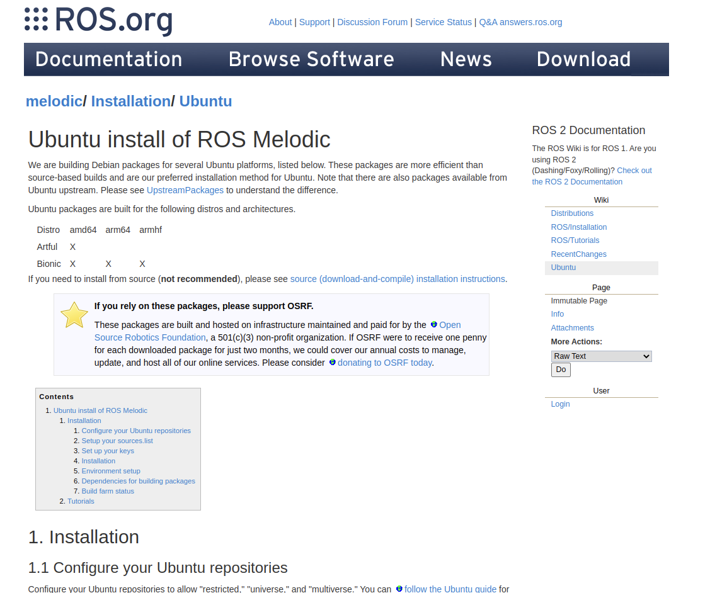

## 软件安装

### 概要
&emsp;&emsp;机械臂SDK与机械臂控制器均基于Ubuntu18.04构建，同时在仿真控制中依赖的ROS系统为Melodic版本。故为了能更好地使用，请用户尽量之保持一致。除此之外，机械臂SDK与机械臂控制器还依赖了许多第三方工具，用户在使用前需要将这些第三方工具安装好。
+ build-essential
+ Boost (1.5.4版本 或 更高)
+ CMake (2.8.3版本 或 更高) 
+ Eigen (3.3.9版本) 
+ LCM (1.4.0版本) 
+ RBDL (2.6.0版本) 

### RBDL安装

### Eigen安装

### Ros(Melodic)安装
&emsp;&emsp;Ros(Melodic)的安装只需要按照其官网上的安装步骤一步步安装即可：https://wiki.ros.org/melodic/Installation/Ubuntu

 

Ros(Melodic)官网安装页面

 
