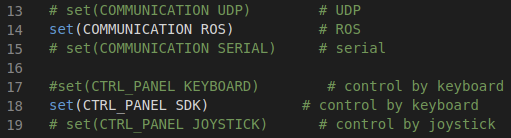
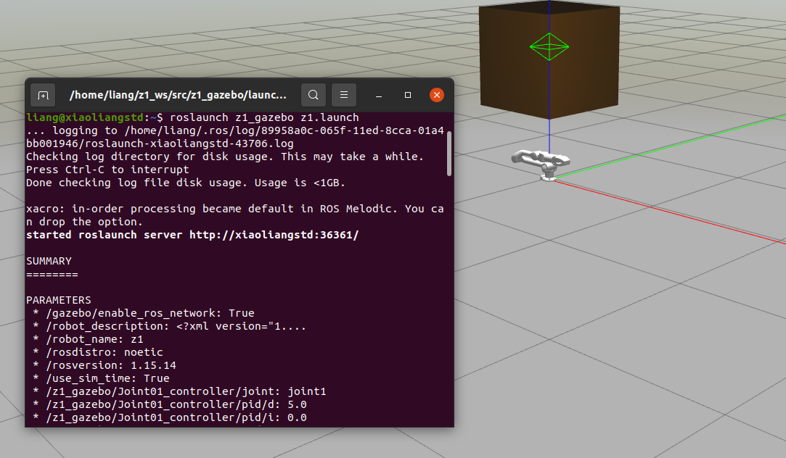
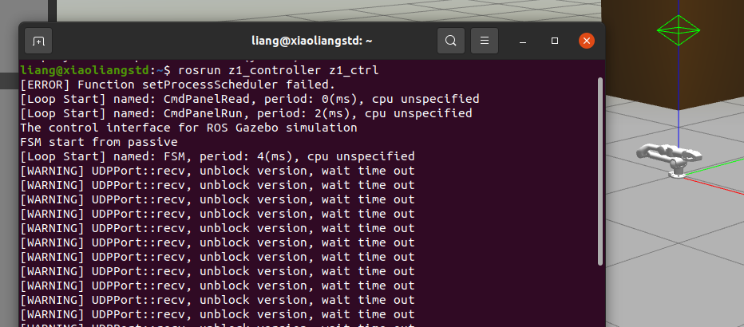

## 仿真控制
### 概要
&emsp;&emsp;在[关系](#关系)小节中我们介绍过`机械臂`、机械臂控制器`z1_ws`和机械臂SDK`unitree_arm_sdk`的关系，故在仿真控制中我们只需要依次启动它们即可，当然前提是用户已经将环境搭建起来并且机械臂SDK编译已经成功。在仿真控制中它们的启动方法为：
1. `机械臂`: &emsp; `roslaunch z1_gazebo z1.launch`
2. 机械臂控制器`z1_ws`: &emsp; `rosrun z1_controller z1_ctrl`
3. 机械臂SDK`unitree_arm_sdk`: &emsp; `./{相对应的可执行文件}`

同时别忘了，在[机械臂SDK介绍](#机械臂SDK介绍)中说的，我们可以对仿真机械臂控制或实物机械臂控制，故还需要修改机械臂控制器`z1_ws`中的编译指导文件`CMakeLists.txt`并重新编译。下面让我们跟随小试牛刀小节来实际尝试一下吧。

### 小试牛刀
&emsp;&emsp;在本小节中，会尽可能详细地带领大家一步一步尝试在仿真中对机械臂的控制。

**1.修改z1_ws的CMakeLists.txt文件** 
&emsp;到z1_ws/src/z1_controller路径下找到CMakeLists.txt文件，打开它，找到下图所式内容并按下图所示修改以支持仿真控制，然后保存该文件(Ctrl+s)

 

z1_ws的CMakeLists.txt文件设置(仿真控制)

 

**2.重新编译z1_ws** 
&emsp;打开一个终端，并将工作路径切换至z1_ws/路径，然后按照    节方法重新编译。若没有编译成功，则需要解决问题，直至编译成功。

**3.启动仿真机械臂** 
&emsp;打开一个终端，输入命令`roslaunch z1_gazebo z1.launch`来启动仿真环境中的机械臂

 

仿真环境中的机械臂

 
如上图所示，当弹出gazebo仿真器并正常显示机械臂，且该终端没有红色的错误提示信息即可认为此步骤执行成功。

**4.启动机械臂控制器** 
&emsp;打开一个终端，输入命令`rosrun z1_controller z1_ctrl`来启动机械臂控制器

 

启动机械臂控制器

 
如上图所示，当执行该条命令后，终端会不断地打印`[WARNING] UDPPort::recv, unblock version, wait time out`语句,这是正常的，因为我们还没有启动机械臂SDK与机械臂控制器通信。

**5.启动机械臂SDK** 
&emsp;打开一个终端，将工作路径切换至z1_sdk/unitree_arm_sdk/build,并使用`ls`命令查看有什么可执行文件。

 

运行机械臂SDK中的bigDemo例子

 
如上图所式，该文件夹内有一个名为`bigDemo`的例子，我们在终端上打入`sudo ./bigDemo`，然后按下键盘上的`Enter`键并输入用户密码即可启动它，随后机械臂就会按照`bigDemo`中编写的控制逻辑运动。