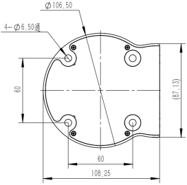
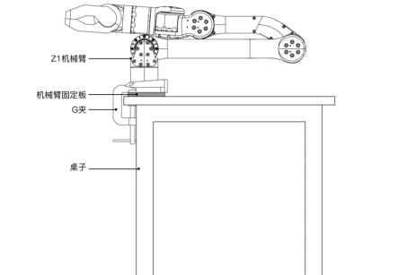

# 机械臂安装

## 物品清单

<center>
    <table border="1">
        <tr><td>类型</td><td>数量</td><td>备注</td></tr>
        <tr><td>机械臂</td><td>1</td><td>/</td></tr>
        <tr><td>电源适配器</td><td>1</td><td>DC24V</td></tr>
        <tr><td>机械臂固定板</td><td>1</td><td>/</td></tr>
        <tr><td>G型夹</td><td>2</td><td>/</td></tr>
        <tr><td>网线</td><td>1</td><td>2m</td></tr>
        <tr><td>M6内六角螺丝</td><td>4</td><td>M6X16</td></tr>
        <tr><td>M2.5内六角螺丝</td><td>2</td><td>M2.5X8</td></tr>
        <tr><td>2mm内六角扳手</td><td>1</td><td>/</td></tr>
        <tr><td>5mm内六角扳手</td><td>1</td><td>/</td></tr>
    </table>
</center>

## 固定机械臂

用户在固定机械臂时可根据机械臂底座孔位尺寸及真实环境自行设计安装台架，机械臂的固定台架不仅需要承受机械臂自身的重量，还要承受最大加速度运动时的瞬时动态作用力。
机械臂使用4颗M6螺栓，用内六角扳手安装机械臂。底座安装图如下

<center>

<br>
<div style="color:orange; border-bottom: 0.1px solid #d9d9d9;
display: inline-block;
color: #999;
padding: 1px;">机械臂底座螺丝安装图</div>
</center>
<br>

当然，我们提供了固定板及G夹，方便直接固定到桌面上。
<center>

<br>
<div style="color:orange; border-bottom: 0.1px solid #d9d9d9;
display: inline-block;
color: #999;
padding: 1px;">机械臂安装图</div>
</center>
<br>

## 线缆连接

机械臂线缆主要有两种：供电线和通信线。机械臂供电线的接头具备防呆功能，供电线插入下图所示的机械臂供电接口。同时将通信线(即网线)的一端插入下图所示的机械臂网口并锁紧即可，通信线的另一端连接电脑。
需要注意将网线插入到机械臂的**主网口**。

```note
机械臂的主网口用于控制机械臂，副网口用于更改默认IP，使用时不可插反。
电源接口不允许热插拔
```

<center>

<br>
<div style="color:orange; border-bottom: 0.1px solid #d9d9d9;
display: inline-block;
color: #999;
padding: 1px;">机械臂线缆连接图</div>
</center>
<br>