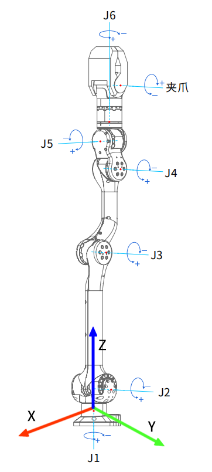

# 键盘控制

z1_controller使用有限状态机进行代码架构，每一个状态机代表具体的工作。

|State|KeySwitch|Switchable|
|:-:|:-:|:-:|
|BACKTOSTART|~|1 2|
|PASSIVE|1|~ 2 3 =|
|JOINTCTRL|2|~ 1 3 4 5 6 7 8 9 0 -|
|CARTESIAN|3|~ 1 2 4 5 6 9|
|MoveJ|4|~ 1 2 3 5 6 9|
|MoveL|5|~ 1 2 3 4 6 9|
|MoveC|6|~ 1 2 3 4 5 9|
|TEACH|7|~ 1 2|
|TEACHREPEAT|8|automatically switched to 2|
|SAVESTATE|9|automatically switched to 2|
|TOSTATE|0|automatically switched to 2|
|CALIBRATION|=|automatically switched to 1|

在键盘控制模式下，按下某个键位就可以进入该状态机，在Switchable列表下为从某一状态机下可以进入的其他状态机。

**为了避免奇异问题，我们建议用户每次使用时先将机械臂通过TOSTAET状态机运行至forward位姿下。**

关闭原来的`z1_ctrl`程序，重新执行`z1_ctrl k`

## BACKTOSTART

所有电机返回初始位置

## PASSIVE

所有电机进入阻尼状态（上电后的默认状态）

## JOINTCTRL

在关节空间速度控制中，可以通过**长按**键盘直接地给定机械臂6个关节运动的速度，从而控制机械臂的运动。

需要再次说明的是，所有关节坐标系均是右手系，在使用前需注意个关节的正反转运动趋势，以确保安全操作。

<table border="1">
    <tr>
        <td>Joint ID</td>
        <td>0</td><td>1</td><td>2</td><td>3</td><td>4</td><td>5</td>
        <td>Gripper</td>
    </tr>
    <tr>
        <td>Keyboard</td>
        <td>Q/A</td><td>W/S</td><td>D/E</td><td>R/F</td><td>T/G</td><td>Y/H</td>
        <td>up/down</td>
    </tr>
    <tr>
        <td>
Joint Action
(right hand)</td>
        <td>
positive/
negative</td><td>
positive/
negative</td>
        <td>
positive/
negative</td><td>
positive/
negative</td>
        <td>
positive/
negative</td><td>
positive/
negative</td>
        <td>
positive/
negative</td>
    </tr>
</table>

 

z1机械臂关节序号及关节转动正方向定义

 

## CARTESIAN

在笛卡尔空间控制中，可以直接地通过键盘或手柄给定机械臂末端的期望位置与姿态的运动速度，进而控制机械臂的运动。

<table border="1">
    <tr>
        <td>Keyboard</td>
        <td>Q/A</td><td>W/S</td><td>E/D</td><td>R/F</td><td>T/G</td><td>Y/H</td>
        <td>Gripper</td>
    </tr>
    <tr>
        <td>Key Function</td>
        <td>
forward/
backward</td><td>
right/
left</td><td>
up/
down</td>
        <td>roll</td><td>pitch</td><td>yaw</td>
        <td>up/down</td>
    </tr>
</table>

 

笛卡尔空间控制

 

## MOVEJ、MOVEL、MOVEC

根据提示输入末端位姿(roll pitch yaw x y z)

点的坐标可以先通过关节控制移动到目标位置，然后通过savestate状态机保存至csv文件或调用getJointState可执行文件获取。

示例：(sdk 中的 highcmd_basic)

1. 先将机械臂运行至forward状态

    按0， 输入forward后enter

2. MOVEJ

    按4， 输入0.5   0.1   0.1   0.5   -0.2   0.5

    请确保输入正确，之后按两次enter，机械臂开始运动

    注：两次enter的目的是：在键盘控制时，我们允许用户在按一次enter后继续输入下一次位姿，完成输入后按两次enter顺序执行

3. MOVEL

    按5， 输入0   0   0   0.45   -0.2   0.2后按两次enter

4. MOVEC

    按6，此时需要输入两次位姿，分别是中间位姿和最终位姿。

    输入0   0   0   0.45   0   0.4后enter，

    再输入0   0   0   0.45   0.2   0.2后按两次enter

## TEACH & TEACHREPEAT

首先按~使机械臂返回原点，或控制机械臂运动至某一初始点位后按2进入关节控制状态机，再按7进入示教状态机后，输入标签名后enter，此时可以拖拽机械臂运动一定的轨迹，机械臂将持续记录轨迹直至用户按2进入关节空间控制。

该轨迹将保存在z1_controller/config目录下一个新的.csv文件中。

对于已有的csv文件，可以按8进入示教重复功能，输入已保存的轨迹标签名，机械臂将重复该示教轨迹运动。

## SAVESTATE & TOSTATE

键盘按9，允许将机械臂某一时刻的各关节角度记录为一个标签，我们称此功能为 **标签记录**。

机械臂会自动保存当前的位姿状态，根据提示输入自定的标签名。
记录的标签保存于savedArmStates.csv文件中。
完成后机械臂及将自动转至关节空间控制状态。

对于savedArmStates.csv中已有的标签，可以在键盘按0后输入已存储的标签名后enter，机械臂将以MoveJ的方式运行至相应位姿。

当运动完成后，机械臂将自动转至关节空间控制状态。

## CALIBRATION

键盘按=，设置当前位置为初始位置，完成设置后机械臂将自动转至阻尼状态。

新的机械臂需在运行程序的第一步执行该操作。此时机械臂需要在**零位**并处于阻尼状态，即刚执行`./z1_ctrl k`
